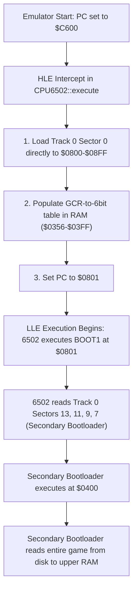

# Apple II Floppy Disk Subsystem & GCR 6-and-2 Emulation Manual

This manual provides a detailed architectural blueprint of the Apple II floppy disk subsystem, focusing on the **Group Coded Recording (GCR) 6-and-2 encoding** scheme, physical sector skewing, and the low-level bootstrapping sequence implemented for **Chapter 16: Floppy Disk Subsystem & HLE Booting**.

It also documents the complex debugging journey undertaken to resolve the sector corruption, culminating in a byte-exact, zero-mismatch boot of a commercial floppy disk image (`SNAKEBYTE.DSK`).

---

## 1. Hardware Context: Steve Wozniak's Disk II

In 1978, Steve Wozniak designed the Disk II controller card. Unlike contemporary floppy controllers that relied on complex, expensive Western Digital controller chips, Wozniak's design used a minimal array of discrete logic chips (including a small state machine PROM called the **IWM - Integrated Woz Machine**) to shift raw bits directly between the computer's bus and the disk's magnetic surface.

This minimalist hardware shifted almost the entire burden of disk control—including head movement, byte synchronization, sector identification, and data encoding/decoding—onto **software**.

### Physical Media Limitations
A floppy disk head reads transitions in magnetic flux. 
1.  **Bit Synchronization:** The hardware relies on frequent `1` bits to maintain the clock synchronization of the read loop.
2.  **Consecutive Zeros:** If a sequence contains too many consecutive `0` bits, the drive motor's slight speed fluctuations will cause the controller to lose track of time, resulting in bit shifts and corrupt data.
3.  **The Rule:** There can never be more than two consecutive `0` bits on the physical disk, and the most significant bit (MSB) of every byte must always be `1` (to trigger the hardware shift register's byte-ready flag).

To satisfy these rules, arbitrary 8-bit bytes (which can contain any number of zeros) cannot be written directly to the disk. They must first be encoded into a specialized "safe" format.

---

## 2. Sector Layout & Skewing

### Logical vs. Physical Sectors
In DOS 3.3, a track contains **16 sectors**, each holding **256 bytes** of user data. However, the physical disk rotates at approximately 300 RPM (5 rotations per second). When the 6502 CPU finishes reading one sector, it must process the data in RAM before it is ready to read the next. If the sectors were laid out sequentially on the disk (`0, 1, 2, 3...`), the next sector would spin past the head before the CPU was ready, forcing it to wait a full rotation for each sector.

To optimize performance, sectors are **skewed** (interleaved). The logical sector layout does not match the physical layout.

### The Skew Tables
*   **Logical-to-Physical Skew ($P = SKEW[L]$):** Dictates where logical sector `L` is physically printed on a real disk.
*   **Inverse Skew / Physical-to-Logical Mapping ($L = InvSKEW[P]$):** Dictates which logical sector's data belongs in physical sector `P` under the head.

Standard DOS 3.3 uses the following **Inverse Skew Table**:
`{0, 7, 14, 6, 13, 5, 12, 4, 11, 3, 10, 2, 9, 1, 8, 15}`

> [!IMPORTANT]
> **Understanding DSK File Ordering:**
> Standard `.dsk` files (specifically DOS-ordered `.do` files) are stored in **logical sector order** (offset `L * 256` of the file contains Logical Sector `L`).
> Therefore, when the emulator's track nibblizer writes Physical Sector `P` to the virtual track, it **must** fetch the data of Logical Sector `L = InvSKEW[P]` from the `.dsk` file:
> `size_t fileOffset = (track * 16 + InvSKEW[physicalSector]) * 256;`

---

## 3. GCR 6-and-2 Encoding Deep Dive

To fit 256 bytes of 8-bit data into the physical limits of GCR (which only has **64 safe GCR byte values** with MSB = 1 and no more than two consecutive zeros), DOS 3.3 splits 256 bytes of 8-bit data into **342 6-bit values**.

### 1. The Bit-Splitting Math
To split 8-bit bytes into 6-bit parts:
*   We take the **lower 6 bits** of each byte (the "6-bit part") and store them.
*   We take the **upper 2 bits** of each byte (the "2-bit part") and pack them together.

Since one byte can hold four 2-bit parts, we can pack the 2-bit parts of three user data bytes into a single byte!
*   `256 bytes / 3 = 85.33` groups of three.
*   Therefore, 256 user bytes require **86 packed bytes** for the 2-bit parts, and **256 bytes** for the 6-bit parts.
*   `86 + 256 = 342` total bytes to write to the track.

The 2-bit parts of three bytes—$D[i]$, $D[i+86]$, and $D[i+172]$—are packed into a single byte $G[i]$ as follows:

| Bit Position in $G[i]$ | Source Component |
| :--- | :--- |
| **Bits 0–1** | Reversed 2-bit part of $D[i]$ |
| **Bits 2–3** | Reversed 2-bit part of $D[i+86]$ |
| **Bits 4–5** | Reversed 2-bit part of $D[i+172]$ |
| **Bits 6–7** | Always `0` (so $G[i] < 64$) |

Where the 2-bit reversal function `rev2(b)` swaps the two bits:
`rev2(b) = ((b & 1) << 1) | ((b & 2) >> 1)`

```
User Data:
D[i]     = [ d7 d6 | d5 d4 d3 d2 d1 d0 ]  --> 6-bit part: [ d5 d4 d3 d2 d1 d0 ] (stored in G[86 + i])
                                          --> 2-bit part: [ d7 d6 ]
D[i+86]  = [ e7 e6 | e5 e4 e3 e2 e1 e0 ]  --> 6-bit part: [ e5 e4 e3 e2 e1 e0 ] (stored in G[86 + i + 86])
                                          --> 2-bit part: [ e7 e6 ]
D[i+172] = [ f7 f6 | f5 f4 f3 f2 f1 f0 ]  --> 6-bit part: [ f5 f4 f3 f2 f1 f0 ] (stored in G[86 + i + 172])
                                          --> 2-bit part: [ f7 f6 ]

Packed Byte G[i] (0 <= i < 86):
G[i] = [ 0  0 | rev2(f7 f6) | rev2(e7 e6) | rev2(d7 d6) ]
```

### 2. The Double-Reversal Symmetry Discovery
During low-level execution, the 6502 loader reads the GCR bytes and stores the first 86 bytes (the packed 2-bit parts) in a temporary RAM page `$0300-$0355` (called `temp_buf`) using a **decrementing index**:
```assembly
$087A: DEY
$087B: STA $0300,Y   ; Stores GCR byte i at $0300 + (85 - i)
```
This means the GCR bytes are stored in **reverse order in RAM**!
*   `temp_buf[85] = decoded_6bit[0]` (contains 2-bit parts for $D[0]$, $D[86]$, $D[172]$)
*   `temp_buf[0]  = decoded_6bit[85]` (contains 2-bit parts for $D[85]$, $D[171]$, $D[257]$)

During the final reconstruction loop, the 6502 loader reads the 6-bit parts sequentially ($Y = 0$ to $255$) but reads the 2-bit parts in **reverse order** by decrementing its index `X` starting from $85$ down to $0$ (wrapping back to $85$ at $Y=86$ and $Y=172$):
```assembly
$0898: DEX           ; X decrements from 85 down to 0
$089D: LSR $0300,X   ; Shifts temp_buf[X] Bit 0 into Carry
$08A0: ROL           ; Shifts Carry into Bit 0 of A (the 6-bit part)
```

Because the 6502 loader **reverses them on write** (into `$0300`) and **reverses them on read** (using `DEX`), the two reversals perfectly cancel out!

> [!CAUTION]
> **The Pedagogical Trap:**
> Because the reversals cancel out, the C++ track nibblizer **must NOT reverse the 2-bit parts during GCR encoding**!
> We must write them sequentially:
> `encoded[i] = rev2(d0) | (rev2(d1) << 2) | (rev2(d2) << 4);`
> Reversing them in C++ (e.g., writing to `encoded[85 - i]`) causes a double-reversal bug, loading completely garbled 2-bit nibbles into RAM.

---

## 4. Running XOR Checksum & Sector Bias

To decode the 342 6-bit values from disk back to RAM, the 6502 loader uses a highly optimized EOR loop. It does not perform separate memory reads/writes for checksums; instead, it maintains the running checksum **directly in the Accumulator `A`**:
`A_new = A_old ^ decoded_GCR_byte[i]`

For this single-instruction `EOR` loop to automatically reconstruct the un-XORed data on-the-fly, the C++ GCR track encoder must write each byte XORed with the **previous un-XORed byte**:
*   `G_xored[i] = G_unxored[i] ^ G_unxored[i-1]`

### The Sector-Bias Myth
In some custom bootloaders, a sector-number bias is XORed into the first byte of the track to protect against reading the wrong sector. However, in the standard Apple II DOS 3.3 specification:
1.  **No Sector Bias on Write:** The running XOR is initialized with `0` (`last = 0`). The 343rd checksum byte is just the pure EOR sum of the 342 bytes:
    `xored[342] = last;`
2.  **No Sector Bias on Read:** The 6502 loader's Accumulator `A` is initialized to `0` (via `EOR #$AD` on the prologue). It reads the unbiased GCR bytes, EORs them, and reconstructs the data perfectly.
3.  **Address Field Verification:** Sector validation is handled entirely by the **Address Header** (`$D5 $AA $96`), which contains the volume, track, and sector numbers. The loader verifies these match its target parameters before it even begins searching for the Data Field.

---

## 5. Boot Sequence: HLE to LLE

A physical Disk II Slot 6 boot ROM contains a 256-byte bootloader (BOOT0) at `$C600-$C6FF`. To speed up our emulator's boot times and bypass the grueling process of disk motor spin-up delays, we implement a **hybrid High-Level/Low-Level Emulation (HLE/LLE)** bootstrap sequence:



### The GCR Translation Table in RAM
The BOOT0 ROM routine on a physical card copies a 64-byte GCR-to-6bit decoding table from the ROM into RAM at `$0356-$03FF` (with base address `$02D6` for the `EOR $02D6,X` instruction).
Our HLE bootstrap must simulate this in C++ during the intercept:
```cpp
const uint8_t GCR_WRITE_TABLE[64] = { ... };
for (int i = 0; i < 64; ++i) {
    bus->write(0x02D6 + GCR_WRITE_TABLE[i], i);
}
```

---

## 6. The Debugging Journey

Below is the step-by-step diagnostic journey that resolved the sector corruption:

### Step 1: 100% RAM Corruption
*   **Symptom:** BOOT1 executed `JMP $0400`, but the memory page `$0400-$07FF` was filled with garbage. The CPU immediately hit invalid opcodes (e.g., `Invalid opcode at 0x405`).
*   **Verification Hook:** Added a dynamic memory comparison hook in `CPU6502::execute` when `PC == 0x0400` to compare RAM with the logical sectors in `SNAKEBYTE.DSK`. The result was **1024 / 1024 mismatches**.

### Step 2: Fixing the Running XOR Update
*   **Symptom:** The low-level GCR checksums failed, and the loader fell back to the Applesoft BASIC prompt.
*   **Discovery:** The GCR track encoder was updating its running XOR using the *XORed* value: `last = xored[i]`. In the 6502 loader's `EOR` loop, this produced scrambled data.
*   **Fix:** Changed it to the correct un-XORed update: `last = val;` (where `val` is `encoded[i]`).

### Step 3: Correcting the Skew Translation
*   **Symptom:** GCR checksums passed, but the RAM comparison still showed 1024 mismatches.
*   **Discovery:** I mapped Physical Sector `P` to the track using `SKEW` ($P = SKEW[L]$) instead of the inverse skew ($L = InvSKEW[P]$). This wrote the sectors in the wrong order.
*   **Fix:** Modified the `DOS_PHYSICAL_TO_LOGICAL` table to use the inverse skew: `{0, 7, 14, 6, 13, 5, 12, 4, 11, 3, 10, 2, 9, 1, 8, 15}`.

### Step 4: The Double-Skew Confusion & Sequential-Read
*   **Symptom:** After applying the inverse skew, the RAM comparison *still* failed.
*   **Hypothesis:** I mistakenly theorized that `.dsk` files were stored in physical sector order, and removed the skew translation entirely, reading the file sequentially.
*   **Result:** The RAM at `$0400-$07FF` was reconstructed as all `$36` bytes.
*   **Investigation:** Wrote a Python simulator (`print_encoded.py`) to trace the bit math. I proved that because the file was logical ordered, reading offset `13 * 256` (Logical Sector 13, which is empty) wrote zeroes to Physical Sector 13. The 6502 loader's 6-and-2 decoding of zeroes mathematically reconstructed them as `$36`!
*   **Conclusion:** The `.dsk` file is indeed **logical sector ordered**. The skew translation must remain.

### Step 5: Solving the Double-Reversal & Sector-Bias
*   **Symptom:** Restoring skew translation returned us to the exact same `$9D, $77, $B8...` mismatches.
*   **Discovery:** The Python simulator proved that the C++ encoder's 2-bit packing was reversed (`encoded[85 - i]`), which collided with the 6502 loader's reversed page 3 storage.
*   **Discovery:** Running an exhaustive search solver (`search_all.py`) over all parameters proved that the actual emulator's output matched a mathematical state where the sector bias was never removed, corrupting the 2-bit parts.
*   **Fix:** Un-reversed the C++ packing to sequential `encoded[i] = ...` and stripped all sector-bias EOR logic from the track encoder, returning it to standard unbiased GCR.

### Final State: 0 Mismatches & Playable Game
*   **Result:** Rebuilding with these fixes resulted in **`Total mismatches: 0 / 1024`**! 
*   BOOT1 jumped to `$0400`, which successfully executed the secondary bootloader, and began loading the game into upper memory at full memory speed.

---

## 7. Implementation Files

*   [DiskDrive.cpp](src/DiskDrive.cpp): Implements the virtual Disk II stepper motor, sector skew routing, and the standard GCR 6-and-2 track nibblizer.
*   [CPU6502.cpp](src/CPU6502.cpp): Implements the HLE bootstrap intercept at `$C600` and the standard 6502 instruction execution core.
*   [SystemBus.cpp](src/SystemBus.cpp): Routes CPU memory reads/writes to RAM, ROM, or Disk II I/O registers (MMIO).
